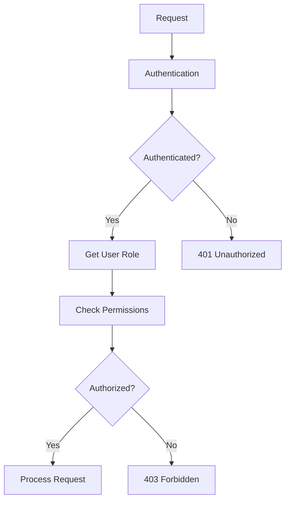

# API Authorization with RBAC

A comprehensive guide to implementing Role-Based Access Control (RBAC) in Node.js REST APIs.

## RBAC Basics

### 1. RBAC Structure
```javascript
// Example RBAC roles and permissions
const roles = {
    admin: ['create', 'read', 'update', 'delete', 'manage_users'],
    editor: ['create', 'read', 'update'],
    viewer: ['read']
};

// User role assignment
const users = [
    { id: 1, email: 'admin@example.com', role: 'admin' },
    { id: 2, email: 'editor@example.com', role: 'editor' },
    { id: 3, email: 'viewer@example.com', role: 'viewer' }
];
```

### 2. RBAC Workflow


## Implementation

### 1. Permission Middleware
```javascript
const checkPermission = (action) => {
    return (req, res, next) => {
        const userRole = req.user.role;
        const permissions = roles[userRole] || [];

        if (permissions.includes(action)) {
            return next();
        }

        res.status(403).json({
            error: 'Access denied'
        });
    };
};

// Usage in routes
app.get('/posts', 
    authMiddleware,
    checkPermission('read'),
    getPosts
);
```

### 2. Resource Ownership
```javascript
const checkOwnership = (model) => {
    return async (req, res, next) => {
        const resource = await model.findById(req.params.id);
        
        if (!resource) {
            return res.status(404).json({
                error: 'Resource not found'
            });
        }

        if (resource.userId.toString() !== req.user.id) {
            return res.status(403).json({
                error: 'Access denied'
            });
        }

        req.resource = resource;
        next();
    };
};

// Usage in routes
app.put('/posts/:id', 
    authMiddleware,
    checkOwnership(Post),
    updatePost
);
```

## Advanced Authorization

### 1. Permission Groups
```javascript
const permissionGroups = {
    post: ['create_post', 'read_post', 'update_post', 'delete_post'],
    user: ['create_user', 'read_user', 'update_user', 'delete_user']
};

const checkGroupPermission = (group, action) => {
    return (req, res, next) => {
        const userRole = req.user.role;
        const permissions = roles[userRole] || [];
        const requiredPermission = `${action}_${group}`;

        if (permissions.includes(requiredPermission)) {
            return next();
        }

        res.status(403).json({
            error: 'Access denied'
        });
    };
};

// Usage in routes
app.delete('/users/:id', 
    authMiddleware,
    checkGroupPermission('user', 'delete'),
    deleteUser
);
```

### 2. Dynamic Role Management
```javascript
class RoleManager {
    constructor() {
        this.roles = {};
    }

    addRole(role, permissions) {
        this.roles[role] = permissions;
    }

    removeRole(role) {
        delete this.roles[role];
    }

    checkPermission(role, action) {
        return this.roles[role]?.includes(action) || false;
    }
}

// Usage
const roleManager = new RoleManager();
roleManager.addRole('moderator', ['read', 'update', 'delete']);

app.get('/moderation', 
    authMiddleware,
    (req, res, next) => {
        if (roleManager.checkPermission(req.user.role, 'read')) {
            return next();
        }
        res.status(403).json({
            error: 'Access denied'
        });
    },
    getModerationData
);
```

## Testing Authorization

### 1. Unit Tests
```javascript
describe('Authorization', () => {
    test('should allow admin to delete', () => {
        const req = { user: { role: 'admin' } };
        const res = {};
        const next = jest.fn();

        checkPermission('delete')(req, res, next);
        expect(next).toHaveBeenCalled();
    });

    test('should deny viewer to create', () => {
        const req = { user: { role: 'viewer' } };
        const res = { status: jest.fn().mockReturnThis(), json: jest.fn() };
        const next = jest.fn();

        checkPermission('create')(req, res, next);
        expect(res.status).toHaveBeenCalledWith(403);
    });
});
```

## Best Practices

1. Follow the principle of least privilege
2. Use role inheritance for complex hierarchies
3. Implement audit logging for sensitive operations
4. Regularly review and update permissions
5. Use attribute-based access control (ABAC) for fine-grained control

## Related Topics
- [[API-Authentication]] - JWT authentication
- [[REST-API-Design]] - REST API design patterns
- [[Express-Security]] - Security best practices
- [[Testing]] - API testing strategies

Tags: #nodejs #api #authorization #rbac #security
